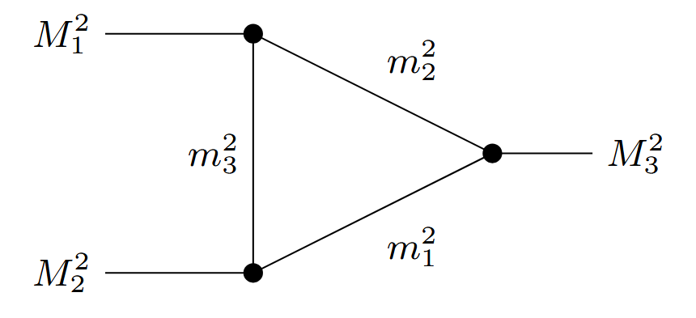

# triangleTools
Triangles (i.e. one-loop, three-point Feynman-like diagrams) appear all over the place in hadron physics. Sometimes it is necessary investigate the kinematic structure of these graphs beyond what is available by established tools (e.g. LoopTools), such deriving the discontinuity across a cut or analyticially continuing them in different masses. As such I constantly find myself re-coding up the same Feynman and dispersion integrals over and over again.

This repository is a set of tools to standardize (for myself and my projects) an interface to code up triangle amplitudes with general masses and evaluate them using different methods. Results tested here can then be put into other codes. 

Setting masses for any triangle use the same interface:
```c++
arguments args;
args._external = {M1sq, M2sq, M3sq};
args._internal = {m1sq, m2sq, m3sq}; 
```
where each mass squared is allowed to be complex (or negative) the indices 1,2,3 follow: 
<p align="center">
  
</p>
This way its easy to keep track where each particle is as each vertex contains one M and two m's each with all three indices. 
